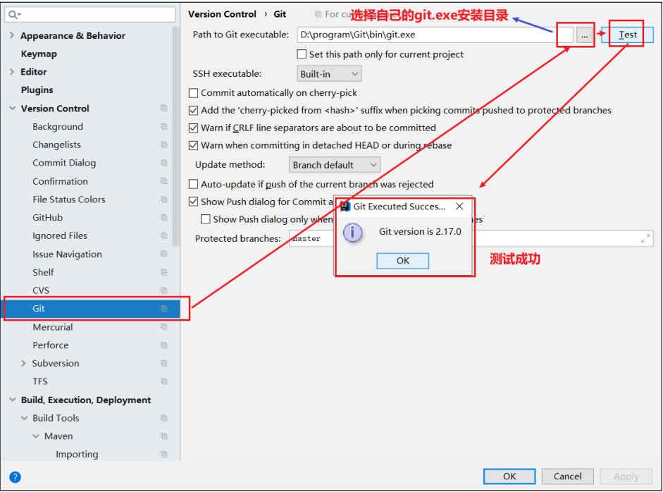
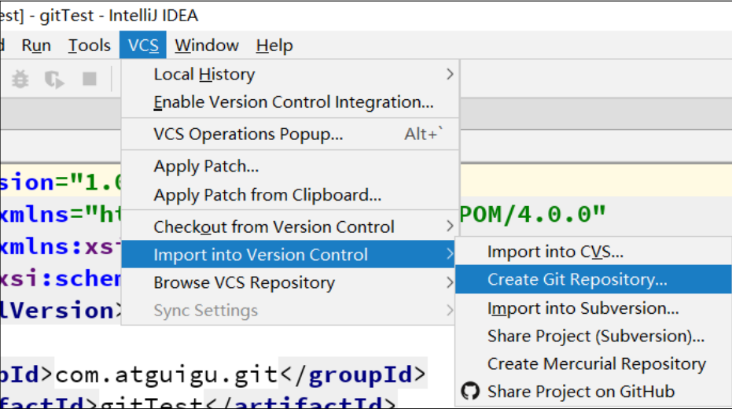
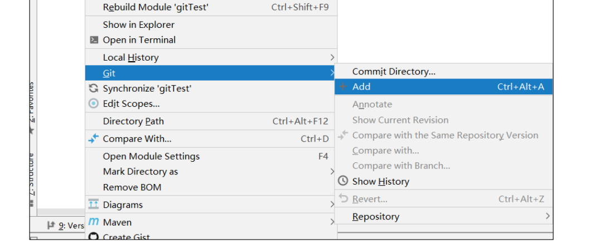
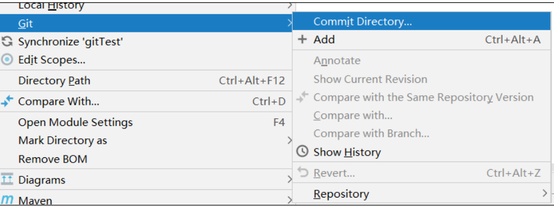
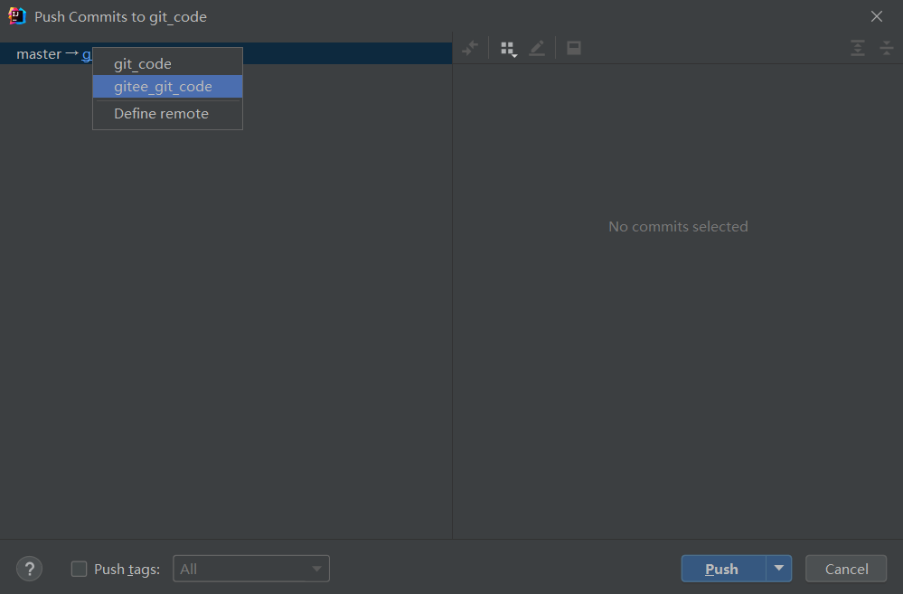
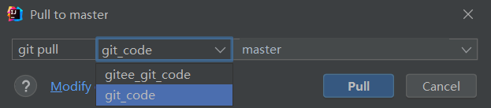
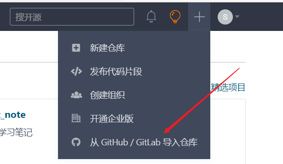
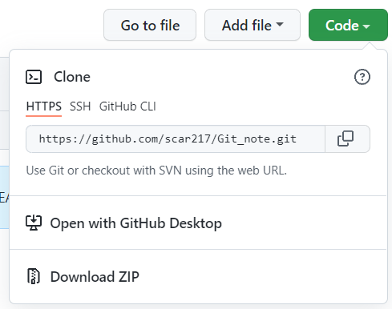
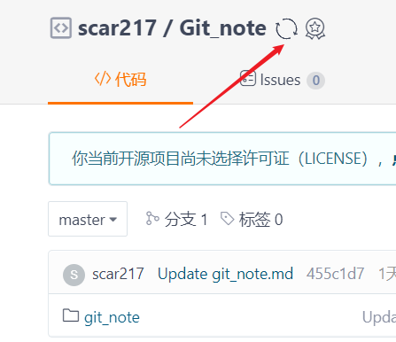

# 2.0

## 一、Git和代码托管中心

代码托管中心是基于网络服务器的远程代码仓库，简称远程库

* 局域网
  * GitLab
* 互联网
  * GitHub
  * Gitee 码云

### 1.1、Git管理的基本层次


## 二、Git常用命令

|               命令名称               |           作用           |
| :----------------------------------: | :----------------------: |
| git config --global user.name 用户名 |       设置用户签名       |
| git config --global user.email 邮箱  |     设置用户签名邮箱     |
|               git init               |       初始化本地库       |
|              git status              |      查看本地库状态      |
|            git add 文件名            |       添加到暂存区       |
|   git commit -m "日志信息" 文件名    |       提交到本地库       |
|              git reflog              |       查看历史记录       |
|       git reset --hard 版本号        |         版本穿梭         |
|               git log                | 详细查看版本信息和提交者 |

### 2.1、添加暂存区

**使用git管理某文件或者生成工作区**：在该文件下进入`Git Bash Here`,输入初始化本地仓库的操作命令`git init`即会生成`.git`文件；使用Git追踪该文件夹下的某文件`git add 文件名`，使其进入暂存区，该区域可以进行版本删除（`git rm --cached 文件名`）

**所有涉及的文件名都需要添加它的后缀名**

### 2.1、提交本地库

**将暂存区的文件提交到本地库**

==基本语法==：`git commit -m "日志信息" 文件名`

==查看文本内容==：`cat 文件名`（只能查看当前指针所指的版本号文件）

**可以修改指针指向的版本号，更新到其他版本的文件**

类似于某文档编辑后，想要返回初始的文本，即`Ctril+Z`

==修改指针代码==：`git reset --hard 版本号`

*版本号通过 `git reflog`查看*

**文件每一次修改都要经过添加暂存区---->提交本地库操作**

## 三、Git分支操作

### 3.1、分支简介

在版本控制过程中，同时推进多个任务，为每个任务，我们就可以创建每个任务的单独分支。使用分支意味着程序员可以把自己的工作从开发主线上分离开来，开发自己分支的时候，不会影响主线分支的运行。


* 分支的好处
  * 同时并行推进多个功能开发，提高开发效率。 各个分支在开发过程中，如果某一个分支开发失败，不会对其他分支有任何影响。失败的分支删除重新开始即可。

### 3.2、分支的常用命令

|      命令名称       |             作用             |
| :-----------------: | :--------------------------: |
|  git branch 分支名  |           创建分支           |
|    git branch -v    |           查看分支           |
| git checkout 分支名 |           切换分支           |
|  git merge 分支名   | 把指定的分支合并到当前分支上 |


* 当前处于master分支操作基础上

#### 3.2.1、合并分支

在`master`的分支上执行分支操作，即将`hot-fix`分支合并到`master`分支上


* *以上操作只会修改 master 分支上的内容，不会修改 hot-fix 的内容*

#### 3.2.2、产生冲突

* 产生冲突的原因：
  * 合并分支时，两个分支在同一个文件的同一个位置有两套完全不同的修改。Git 无法替我们决定使用哪一个。必须人为决定新代码内容。 
* 查看冲突：（假设此时的文件名为`hello.txt`）
  * 冲突产生的表现：后面状态为 `MERGING` 
  * 手动打开修改文件代码：`vim 文件名`
    * 打开查看代码：`cat 文件名`
    * 
    * 特殊符号：`<<<<<<< HEAD 当前分支的代码 ======= 合并过来的代码 >>>>>>> hot-fix` 
* 解决冲突
  * 编辑有冲突的文件，删除特殊符号，决定要使用的内容 （由上述图片修改后的图片）
    * 
  * 添加到暂存区
    * `git add hello.txt`
  * 执行提交**（注意：此时使用 git commit 命令时不能带文件名）**
    * `git commit -m "merge hot-fix"`
    * 此时`MERGING` 消失

## 四、Git团队协作机制

### 4.1、团队协作


**解释：**

> 以上两个2个本地库之间需要建立某种认证才能互相协作
>
> clone:克隆远程库
>
> pull：拉取远程库的代码，更新本地库
>
> push：上传本地库代码

### 4.2、跨团队协作


**解释：**

> 岳不群和东方不败分别为两个不同的团队
>
> fork：远程库之间的复制
>
> Pull request：拉取请求
>
> merge：合并

## 五、GitHub操作

### 5.1、创建远程库


### 5.2、远程仓库操作

|              命令名称              |                           作用                           |
| :--------------------------------: | :------------------------------------------------------: |
|           git remote -v            |                 查看当前所有远程地址别名                 |
|    git remote add 别名 远程地址    |                          起别名                          |
|         git push 别名 分支         |              推送本地分支上的内容到远程仓库              |
|         git clone 远程地址         |                将远程仓库的内容克隆到本地                |
| git pull 远程库地址别名 远程分支名 | 将远程仓库对于分支最新内容拉下来后与当前本地分支直接合并 |

#### 5.2.1、创建远程仓库别名

* 基本语法
  * 查看当前所有远程地址别名：`git remote -v`
  * 创建：`git remote add 别名 远程地址`
* **建议别名与远程库名一致**
* 此处的别名为`Git_note`

#### 5.2.2、推送本地库到远程库

* 基本语法
  * `git push 别名 分支名`
* 实操
  * 

#### 5.2.3、拉取远程库到本地库

当在GitHub中更改文档时，本地库中的文档发生更改，需要拉取远程库从而**更新本地库**

从远程库拉取的代码会自动提交到本地库

* 基本语法
  * `git pull 远程库地址别名 远程分支名` 
* 根据上述实操
  * `git pull Git_note master`

#### 5.2.4、克隆远程仓库到本地

* 基本语法
  * `git clone 远程地址`
  * 远程地址的获取
    * 
* 实操
  * 
* 小结：clone 会做如下操作。1、拉取代码。2、初始化本地仓库。3、创建别名（默认为`origin`）

**克隆不需要权限，push需要加入该团队**

### 5.3、邀请加入团队

* 在某个远程库中：
  * 

### 5.4、跨团队协作

参照配套PDF

### 5.5、SSH免密登录

git使用`https`协议，每次pull, push都要输入密码，相当的烦。
使用git协议，然后使用[ssh](https://so.csdn.net/so/search?q=ssh&spm=1001.2101.3001.7020)密钥。这样可以省去每次都输密码。

大概需要三个步骤：
一、本地生成[密钥](https://so.csdn.net/so/search?q=密钥&spm=1001.2101.3001.7020)对；
二、设置github上的公钥；
三、修改git的remote url为git协议。

**详细查看PDF**

## 六、IDEA集成Git

### 6.1、配置Git忽略文件

* 为什么忽略？

  * 与项目的实际功能无关，不参与服务器上部署运行。把它们忽略掉能够屏蔽 `IDE` 工具之间的差异

* 怎么忽略？

  * 创建忽略规则文件 `xxxx.ignore`（前缀名随便起，建议是 `git.ignore`） 这个文件的存放位置原则上在哪里都可以，为了便于让`~/.gitconfig` 文件引用，建议也放在用户家目录下 

    * 忽略规则文件格式：

      * ```
        # Compiled class file 
        *.class 
        
        # Log file 
        *.log 
         
        # BlueJ files 
        *.ctxt 
         
        # Mobile Tools for Java (J2ME) 
        .mtj.tmp/ 
         
        # Package Files # 
        *.jar 
        *.war 
        *.nar 
        *.ear 
        *.zip 
        *.tar.gz 
        *.rar 
         
        # virtual machine crash logs, see 
        http://www.java.com/en/download/help/error_hotspot.xml 
        hs_err_pid* 
         
        .classpath 
        .project 
        .settings 
        target 
        .idea 
        *.iml 
        ```

    * `.gitconfig` 文件中引用忽略配置文件格式

      * ```格式
        [user] 
         name = Layne 
         email = Layne@atguigu.com 
        [core] 
         excludesfile = C:/Users/asus/git.ignore 
        注意：这里要使用“正斜线（/）”，不要使用“反斜线（\）”
        ```

### 6.2、定位Git程序



### 6.3、初始化本地仓库



#### 6.3.1、添加暂存区



#### 6.3.2、提交本地库



#### 6.3.3、其他功能参考PDF

## 七、国内代码托管中心-码云(gitee)

码云是开源中国推出的基于 Git 的代码托管服务中心，[网址是](https://gitee.com/)，使用方式跟 GitHub 一样

**上传代码**其他与GitHub一致，push时需要选择仓库



* 第一个为GitHub上的某个仓库
* 第二个为gitee上的某个仓库

**拉取代码**



* 选择某个托管网站的仓库

### 7.1、码云复制GitHub项目



* 输入GitHub仓库的HTTP协议
  * 
* 当GitHub仓库发生更新，更新Gitee新版本操作
  * 

### 7.2、其他操作与GitHub一致

### 7.3、Gitee与IDEA使用需要安装插件

## 八、自建代码托管平台-GitLab

